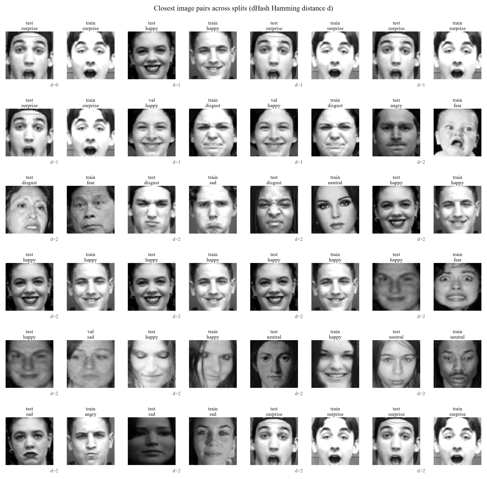
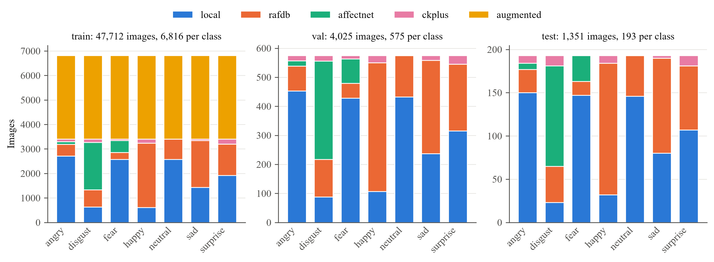

# Data report

Generated by `python -m src.data.inspect --raw dataset` on 2026-10-05 11:09.

## Summary

- 53,088 images in 7 classes: angry, disgust, fear, happy, neutral, sad, surprise.
- Images per split: train 47,712, val 4,025, test 1,351.
- Imbalance ratio on train (largest / smallest class): 1.00.
- Image size (min / median / max): width 48/48/48, height 48/48/48 px.
- Color modes: L 53,088.
- Unreadable files: 0.
- Copies across splits: 0 exact (MD5), 0 mirrored or exact (dHash), 1,498 near pairs (dHash distance <= 4) involving 362 val/test images, of which 0 pairs (0 val/test images) are likely copies of one photo.

## Images per class

| label | train | val | test |
|---|---|---|---|
| angry | 6,816 | 575 | 193 |
| disgust | 6,816 | 575 | 193 |
| fear | 6,816 | 575 | 193 |
| happy | 6,816 | 575 | 193 |
| neutral | 6,816 | 575 | 193 |
| sad | 6,816 | 575 | 193 |
| surprise | 6,816 | 575 | 193 |

## Images per source

`augmented` = offline-augmented copies, one per train original (train only).

| source | train | val | test |
|---|---|---|---|
| affectnet | 2,539 | 441 | 153 |
| augmented | 23,856 | 0 | 0 |
| ckplus | 756 | 121 | 45 |
| local | 12,453 | 2,060 | 685 |
| rafdb | 8,108 | 1,403 | 468 |

### train: images per class and source

| label | affectnet | augmented | ckplus | local | rafdb |
|---|---|---|---|---|---|
| angry | 114 | 3,408 | 108 | 2,707 | 479 |
| disgust | 1,934 | 3,408 | 144 | 635 | 695 |
| fear | 491 | 3,408 | 63 | 2,577 | 277 |
| happy | 0 | 3,408 | 171 | 608 | 2,629 |
| neutral | 0 | 3,408 | 0 | 2,577 | 831 |
| sad | 0 | 3,408 | 63 | 1,431 | 1,914 |
| surprise | 0 | 3,408 | 207 | 1,918 | 1,283 |

### val: images per class and source

| label | affectnet | ckplus | local | rafdb |
|---|---|---|---|---|
| angry | 18 | 18 | 453 | 86 |
| disgust | 339 | 19 | 88 | 129 |
| fear | 84 | 12 | 428 | 51 |
| happy | 0 | 25 | 107 | 443 |
| neutral | 0 | 0 | 432 | 143 |
| sad | 0 | 17 | 237 | 321 |
| surprise | 0 | 30 | 315 | 230 |

### test: images per class and source

| label | affectnet | ckplus | local | rafdb |
|---|---|---|---|---|
| angry | 7 | 9 | 150 | 27 |
| disgust | 116 | 12 | 23 | 42 |
| fear | 30 | 0 | 147 | 16 |
| happy | 0 | 9 | 32 | 152 |
| neutral | 0 | 0 | 146 | 47 |
| sad | 0 | 3 | 80 | 110 |
| surprise | 0 | 12 | 107 | 74 |

## Manifest consistency

- Files on disk without a manifest row: 0.
- Manifest rows without a file: 0.
- Pixel MD5 differs from the manifest: 0 of 29,232 hashed rows.
- dHash differs from the manifest: 0 of 29,232 hashed rows.

## Leakage check across splits

Hashes are computed from the image files: MD5 of the 48x48 grayscale pixels (exact copies), a 64-bit dHash taken as the minimum over the image and its mirror (mirrored copies), and the dHash Hamming distance, both orientations, for near copies (distance <= 4). Pairs are val-train, test-train and test-val; augmented train copies are included.

- Exact copies across splits (MD5): **0**.
- Mirrored or exact copies across splits (dHash): **0**.
- Near pairs across splits: **1,498**, involving 362 val/test images.
- Likely copies of one photo (distance <= 1, or pixel correlation >= 0.84 after shifts of up to 3 px and mirroring): **0** pairs, involving 0 val/test images.
- Near pairs of two different known people (CK+ subject ids), never counted as copies: 557.

### Near pairs per distance

Unrelated faces share a label about 14% of the time, so the same-label share hints at how many pairs are real copies at each distance. Likely copies also need a pixel correlation >= 0.84 (or distance <= 1).

| distance | pairs | val_test_images | same_label | likely_copies | copies_same_label |
|---|---|---|---|---|---|
| 0 | 1 | 1 | 100% | 0 | - |
| 1 | 6 | 6 | 67% | 0 | - |
| 2 | 64 | 48 | 53% | 0 | - |
| 3 | 291 | 152 | 44% | 0 | - |
| 4 | 1,136 | 332 | 44% | 0 | - |

### Near pairs (closest first, first 100)

Full list: `near_duplicates.csv`. A small distance is a candidate copy, not proof: check the image grid below before acting. Nothing was moved or deleted.

| split_a | file_a | label_a | source_a | split_b | file_b | label_b | source_b | distance | ncc | different_person | likely_copy |
|---|---|---|---|---|---|---|---|---|---|---|---|
| test | surprise/ckplus_7edfa2bfd7e85995.png | surprise | ckplus | train | surprise/ckplus_6cae1ef311be2730.png | surprise | ckplus | 0 | 0.778 | 1 | 0 |
| test | happy/ckplus_0d0226fdcd34fbb1.png | happy | ckplus | train | happy/ckplus_3e0213aa7874622a.png | happy | ckplus | 1 | 0.874 | 1 | 0 |
| test | surprise/ckplus_7edfa2bfd7e85995.png | surprise | ckplus | train | surprise/ckplus_4e0661b4d01ea472.png | surprise | ckplus | 1 | 0.75 | 1 | 0 |
| test | surprise/ckplus_95e95f936e0a9258.png | surprise | ckplus | train | surprise/ckplus_6cae1ef311be2730.png | surprise | ckplus | 1 | 0.798 | 1 | 0 |
| test | surprise/ckplus_f2abf14d0a7bc52b.png | surprise | ckplus | train | surprise/ckplus_6cae1ef311be2730.png | surprise | ckplus | 1 | 0.794 | 1 | 0 |
| val | happy/ckplus_860b10e06ee5debf.png | happy | ckplus | train | disgust/ckplus_c9fbf8c55301d052.png | disgust | ckplus | 1 | 0.834 | 1 | 0 |
| val | happy/ckplus_9a65de6796bdada9.png | happy | ckplus | train | disgust/ckplus_c9fbf8c55301d052.png | disgust | ckplus | 1 | 0.839 | 1 | 0 |
| test | angry/ckplus_dddb6d868d6c942b.png | angry | ckplus | train | fear/affectnet_1bf7b33c548b1c44.png | fear | affectnet | 2 | 0.617 | 0 | 0 |
| test | disgust/affectnet_318f483354cb5b56.png | disgust | affectnet | train | fear/local_d2e48cb9940ac11a.png | fear | local | 2 | 0.741 | 0 | 0 |
| test | disgust/ckplus_681e63eb592248a9.png | disgust | ckplus | train | sad/ckplus_2465707da82fd464.png | sad | ckplus | 2 | 0.859 | 1 | 0 |
| test | disgust/ckplus_c8d86d1494bb383b.png | disgust | ckplus | train | neutral/local_d57aa55a6b99abfb.png | neutral | local | 2 | 0.757 | 0 | 0 |
| test | happy/ckplus_0d0226fdcd34fbb1.png | happy | ckplus | train | happy/ckplus_07085b7a4e942d37.png | happy | ckplus | 2 | 0.878 | 1 | 0 |
| test | happy/ckplus_0d0226fdcd34fbb1.png | happy | ckplus | train | happy/ckplus_a295b593c304abb0.png | happy | ckplus | 2 | 0.876 | 1 | 0 |
| test | happy/ckplus_5bc453244c9dbd69.png | happy | ckplus | train | happy/ckplus_3e0213aa7874622a.png | happy | ckplus | 2 | 0.867 | 1 | 0 |
| test | happy/ckplus_dba638fd49034662.png | happy | ckplus | train | happy/ckplus_3e0213aa7874622a.png | happy | ckplus | 2 | 0.862 | 1 | 0 |
| test | happy/rafdb_458d02cedd7a3058.png | happy | rafdb | train | fear/rafdb_3f5824e5ed646a3f.png | fear | rafdb | 2 | 0.626 | 0 | 0 |
| test | happy/rafdb_458d02cedd7a3058.png | happy | rafdb | val | sad/rafdb_e9a64694444c6a5d.png | sad | rafdb | 2 | 0.676 | 0 | 0 |
| test | happy/rafdb_9ff443a4c12a890c.png | happy | rafdb | train | happy/aug_rafdb_d646f51a8b7a75ba.png | happy | augmented | 2 | 0.784 | 0 | 0 |
| test | neutral/local_9d243130bf221370.png | neutral | local | train | happy/rafdb_b1353113ef88edff.png | happy | rafdb | 2 | 0.76 | 0 | 0 |
| test | neutral/rafdb_f3ba6f4f7ae5cc68.png | neutral | rafdb | train | neutral/local_d2e61d3ddfa03a55.png | neutral | local | 2 | 0.82 | 0 | 0 |
| test | sad/ckplus_190344838efd85a1.png | sad | ckplus | train | angry/ckplus_6d4de3581c035390.png | angry | ckplus | 2 | 0.892 | 1 | 0 |
| test | sad/rafdb_49ced48401a3c601.png | sad | rafdb | train | sad/local_33f515b0a4c397e1.png | sad | local | 2 | 0.649 | 0 | 0 |
| test | surprise/ckplus_95e95f936e0a9258.png | surprise | ckplus | train | surprise/ckplus_4e0661b4d01ea472.png | surprise | ckplus | 2 | 0.79 | 1 | 0 |
| test | surprise/ckplus_f2abf14d0a7bc52b.png | surprise | ckplus | train | surprise/ckplus_4e0661b4d01ea472.png | surprise | ckplus | 2 | 0.79 | 1 | 0 |
| test | surprise/rafdb_7ddfa0de6fe31795.png | surprise | rafdb | train | surprise/rafdb_16d8c186c2125f36.png | surprise | rafdb | 2 | 0.632 | 0 | 0 |
| test | surprise/rafdb_b194385b2952fa88.png | surprise | rafdb | train | disgust/aug_rafdb_a7f701299f907043.png | disgust | augmented | 2 | 0.794 | 0 | 0 |
| test | surprise/rafdb_b194385b2952fa88.png | surprise | rafdb | train | fear/rafdb_ca2c011ecb871062.png | fear | rafdb | 2 | 0.737 | 0 | 0 |
| val | angry/local_57c40da7bea7fb52.png | angry | local | train | angry/aug_local_b631a58ffa7a39a7.png | angry | augmented | 2 | 0.733 | 0 | 0 |
| val | disgust/affectnet_49f18896280d634e.png | disgust | affectnet | train | angry/local_aeb852bc7c2a320c.png | angry | local | 2 | 0.783 | 0 | 0 |
| val | disgust/affectnet_49f18896280d634e.png | disgust | affectnet | train | happy/aug_rafdb_aac1f121f6b94404.png | happy | augmented | 2 | 0.771 | 0 | 0 |
| val | disgust/affectnet_49f18896280d634e.png | disgust | affectnet | train | happy/rafdb_033f3b83990a6dea.png | happy | rafdb | 2 | 0.585 | 0 | 0 |
| val | disgust/affectnet_49f18896280d634e.png | disgust | affectnet | train | neutral/aug_local_909827895303e044.png | neutral | augmented | 2 | 0.744 | 0 | 0 |
| val | disgust/affectnet_49f18896280d634e.png | disgust | affectnet | train | surprise/local_43416432b3f8ad85.png | surprise | local | 2 | 0.768 | 0 | 0 |
| val | disgust/ckplus_89b3a1ca3362bffc.png | disgust | ckplus | train | disgust/ckplus_a53b0733b4faad29.png | disgust | ckplus | 2 | 0.839 | 1 | 0 |
| val | disgust/ckplus_c0db5ab601fdbc04.png | disgust | ckplus | train | disgust/ckplus_d776e1ddca38f9e2.png | disgust | ckplus | 2 | 0.794 | 1 | 0 |
| val | disgust/rafdb_f7397e9e65ff14b5.png | disgust | rafdb | train | fear/aug_rafdb_67e51fea3c7c5ec6.png | fear | augmented | 2 | 0.637 | 0 | 0 |
| val | fear/ckplus_15adbcb03dd03774.png | fear | ckplus | train | fear/ckplus_309b26e85019d350.png | fear | ckplus | 2 | 0.8 | 1 | 0 |
| val | fear/ckplus_2ea50329b132129c.png | fear | ckplus | train | fear/ckplus_309b26e85019d350.png | fear | ckplus | 2 | 0.796 | 1 | 0 |
| val | fear/ckplus_52f676c98b228cb6.png | fear | ckplus | train | fear/ckplus_309b26e85019d350.png | fear | ckplus | 2 | 0.792 | 1 | 0 |
| val | happy/ckplus_3bc48654bf3323a2.png | happy | ckplus | train | disgust/local_c9aafaebe1ae8c94.png | disgust | local | 2 | 0.838 | 0 | 0 |
| val | happy/ckplus_860b10e06ee5debf.png | happy | ckplus | train | disgust/ckplus_d46a7d335b04e89d.png | disgust | ckplus | 2 | 0.848 | 1 | 0 |
| val | happy/ckplus_911d35fc8e229ddf.png | happy | ckplus | train | happy/ckplus_24e66894ccd05640.png | happy | ckplus | 2 | 0.816 | 1 | 0 |
| val | happy/ckplus_9a65de6796bdada9.png | happy | ckplus | train | disgust/ckplus_d46a7d335b04e89d.png | disgust | ckplus | 2 | 0.85 | 1 | 0 |
| val | happy/ckplus_f711153f7667c981.png | happy | ckplus | train | happy/ckplus_66c52faf47873843.png | happy | ckplus | 2 | 0.874 | 1 | 0 |
| val | happy/local_00304b36a275462a.png | happy | local | train | neutral/local_4ecb9e2f6373a0fa.png | neutral | local | 2 | 0.797 | 0 | 0 |
| val | happy/rafdb_3f68cc83361783a7.png | happy | rafdb | train | happy/rafdb_c70c69f3ba1190dc.png | happy | rafdb | 2 | 0.739 | 0 | 0 |
| val | happy/rafdb_3f68cc83361783a7.png | happy | rafdb | train | surprise/rafdb_a14360aca594e2e2.png | surprise | rafdb | 2 | 0.7 | 0 | 0 |
| val | happy/rafdb_3fc7a207addf7804.png | happy | rafdb | train | angry/rafdb_1bb1a943b278a82b.png | angry | rafdb | 2 | 0.417 | 0 | 0 |
| val | happy/rafdb_5c63cf2220957d1f.png | happy | rafdb | train | happy/rafdb_b29a4bc42ac6de37.png | happy | rafdb | 2 | 0.765 | 0 | 0 |
| val | happy/rafdb_8f7ca0bc16c52a75.png | happy | rafdb | train | happy/rafdb_0a631877b2268962.png | happy | rafdb | 2 | 0.686 | 0 | 0 |
| val | happy/rafdb_8f7ca0bc16c52a75.png | happy | rafdb | train | happy/rafdb_17a8d56328512cf7.png | happy | rafdb | 2 | 0.781 | 0 | 0 |
| val | happy/rafdb_dd4919c8a4b19672.png | happy | rafdb | train | happy/rafdb_16d521976136c634.png | happy | rafdb | 2 | 0.726 | 0 | 0 |
| val | neutral/local_8331f15292450846.png | neutral | local | train | neutral/local_293d57e74edfb2ca.png | neutral | local | 2 | 0.675 | 0 | 0 |
| val | neutral/rafdb_a808e74aebc9cb81.png | neutral | rafdb | train | neutral/local_efb0d430889ade8e.png | neutral | local | 2 | 0.786 | 0 | 0 |
| val | sad/ckplus_235314cb0e034a96.png | sad | ckplus | train | sad/ckplus_9660d81108cf3b35.png | sad | ckplus | 2 | 0.781 | 1 | 0 |
| val | sad/ckplus_235314cb0e034a96.png | sad | ckplus | train | sad/ckplus_b328215f8309a17b.png | sad | ckplus | 2 | 0.774 | 1 | 0 |
| val | sad/local_00c15cb85c9c3802.png | sad | local | train | disgust/rafdb_04f338bf7d9fb5f4.png | disgust | rafdb | 2 | 0.577 | 0 | 0 |
| val | sad/local_00c15cb85c9c3802.png | sad | local | train | sad/aug_local_a14962e76dc9c0d6.png | sad | augmented | 2 | 0.571 | 0 | 0 |
| val | sad/rafdb_4048b202f3d2688e.png | sad | rafdb | train | disgust/aug_ckplus_cc55696fd4d7f3ce.png | disgust | augmented | 2 | 0.784 | 0 | 0 |
| val | sad/rafdb_e9a64694444c6a5d.png | sad | rafdb | train | fear/rafdb_3f5824e5ed646a3f.png | fear | rafdb | 2 | 0.693 | 0 | 0 |
| val | surprise/ckplus_4b8bdfd663911cf5.png | surprise | ckplus | train | surprise/ckplus_812a04612983235f.png | surprise | ckplus | 2 | 0.863 | 1 | 0 |
| val | surprise/ckplus_4b8bdfd663911cf5.png | surprise | ckplus | train | surprise/ckplus_c375289a1cb314b9.png | surprise | ckplus | 2 | 0.864 | 1 | 0 |
| val | surprise/ckplus_4b8bdfd663911cf5.png | surprise | ckplus | train | surprise/ckplus_d1dbba5d5d57cd02.png | surprise | ckplus | 2 | 0.861 | 1 | 0 |
| val | surprise/ckplus_95164c906476b69d.png | surprise | ckplus | train | surprise/ckplus_34902cdef7cdc90e.png | surprise | ckplus | 2 | 0.719 | 1 | 0 |
| val | surprise/ckplus_95164c906476b69d.png | surprise | ckplus | train | surprise/ckplus_678775d1eba0a48c.png | surprise | ckplus | 2 | 0.721 | 1 | 0 |
| val | surprise/ckplus_95164c906476b69d.png | surprise | ckplus | train | surprise/ckplus_d628a581c3740f87.png | surprise | ckplus | 2 | 0.721 | 1 | 0 |
| val | surprise/local_dbd096163ae52088.png | surprise | local | train | fear/affectnet_03098794a9bf8eba.png | fear | affectnet | 2 | 0.604 | 0 | 0 |
| val | surprise/rafdb_3a27a7cc84cbea15.png | surprise | rafdb | train | happy/rafdb_fa87bcd759c9c3ed.png | happy | rafdb | 2 | 0.784 | 0 | 0 |
| val | surprise/rafdb_5e4bcdbc11917879.png | surprise | rafdb | train | happy/rafdb_a8fb4b97af0aef1e.png | happy | rafdb | 2 | 0.808 | 0 | 0 |
| val | surprise/rafdb_b541beac58223047.png | surprise | rafdb | train | fear/aug_rafdb_67e51fea3c7c5ec6.png | fear | augmented | 2 | 0.499 | 0 | 0 |
| val | surprise/rafdb_b541beac58223047.png | surprise | rafdb | train | fear/rafdb_ca2c011ecb871062.png | fear | rafdb | 2 | 0.544 | 0 | 0 |
| test | angry/ckplus_0df67e237ded3070.png | angry | ckplus | train | disgust/ckplus_85a3962027e5e101.png | disgust | ckplus | 3 | 0.796 | 1 | 0 |
| test | angry/ckplus_282f07d66b3294e4.png | angry | ckplus | train | fear/affectnet_1bf7b33c548b1c44.png | fear | affectnet | 3 | 0.616 | 0 | 0 |
| test | angry/ckplus_28e6f2b2b685eb24.png | angry | ckplus | train | disgust/ckplus_85a3962027e5e101.png | disgust | ckplus | 3 | 0.795 | 1 | 0 |
| test | angry/ckplus_8f25d6a83eb4f07b.png | angry | ckplus | train | fear/affectnet_1bf7b33c548b1c44.png | fear | affectnet | 3 | 0.609 | 0 | 0 |
| test | angry/ckplus_dddb6d868d6c942b.png | angry | ckplus | train | disgust/ckplus_51a96f0e79e851ee.png | disgust | ckplus | 3 | 0.793 | 1 | 0 |
| test | angry/local_6480d163ce599664.png | angry | local | train | surprise/ckplus_1d1939096aa1958e.png | surprise | ckplus | 3 | 0.661 | 0 | 0 |
| test | angry/local_6480d163ce599664.png | angry | local | train | surprise/ckplus_8654df9609df9002.png | surprise | ckplus | 3 | 0.657 | 0 | 0 |
| test | angry/local_9e6e0b982ada1030.png | angry | local | train | neutral/local_3025093a6ab08d2c.png | neutral | local | 3 | 0.821 | 0 | 0 |
| test | angry/rafdb_be7a2b7bfe403949.png | angry | rafdb | train | disgust/local_83ef94057904661e.png | disgust | local | 3 | 0.715 | 0 | 0 |
| test | angry/rafdb_cc3eeec7729c6103.png | angry | rafdb | train | angry/rafdb_662f5e3f8f35dd0d.png | angry | rafdb | 3 | 0.613 | 0 | 0 |
| test | angry/rafdb_cc3eeec7729c6103.png | angry | rafdb | train | happy/aug_rafdb_d2143b6c224a0b93.png | happy | augmented | 3 | 0.66 | 0 | 0 |
| test | angry/rafdb_cc3eeec7729c6103.png | angry | rafdb | train | happy/rafdb_9dc5e170e0b72e4a.png | happy | rafdb | 3 | 0.703 | 0 | 0 |
| test | angry/rafdb_cc3eeec7729c6103.png | angry | rafdb | train | neutral/local_d0fdf07246000cf5.png | neutral | local | 3 | 0.674 | 0 | 0 |
| test | disgust/affectnet_10b6d5b80e3359ca.png | disgust | affectnet | train | disgust/aug_ckplus_cb9415c9eb778ee1.png | disgust | augmented | 3 | 0.595 | 0 | 0 |
| test | disgust/affectnet_10b6d5b80e3359ca.png | disgust | affectnet | train | surprise/local_8e7dbd6e28968ff4.png | surprise | local | 3 | 0.729 | 0 | 0 |
| test | disgust/ckplus_681e63eb592248a9.png | disgust | ckplus | train | disgust/ckplus_0f10a66fa33943c2.png | disgust | ckplus | 3 | 0.81 | 1 | 0 |
| test | disgust/ckplus_681e63eb592248a9.png | disgust | ckplus | train | sad/ckplus_55d0bca766871681.png | sad | ckplus | 3 | 0.859 | 1 | 0 |
| test | disgust/ckplus_681e63eb592248a9.png | disgust | ckplus | train | sad/ckplus_a86e46cc2dd83a87.png | sad | ckplus | 3 | 0.858 | 1 | 0 |
| test | disgust/ckplus_681e63eb592248a9.png | disgust | ckplus | train | surprise/ckplus_9e6a068cad2007e6.png | surprise | ckplus | 3 | 0.787 | 1 | 0 |
| test | disgust/ckplus_c8d86d1494bb383b.png | disgust | ckplus | train | surprise/aug_local_a1d7abd96bb0b67c.png | surprise | augmented | 3 | 0.736 | 0 | 0 |
| test | disgust/ckplus_f768337b940d8360.png | disgust | ckplus | train | fear/local_a8f32db34f78230a.png | fear | local | 3 | 0.696 | 0 | 0 |
| test | disgust/ckplus_f768337b940d8360.png | disgust | ckplus | train | neutral/aug_local_d2e61d3ddfa03a55.png | neutral | augmented | 3 | 0.819 | 0 | 0 |
| test | disgust/ckplus_f768337b940d8360.png | disgust | ckplus | train | neutral/local_d57aa55a6b99abfb.png | neutral | local | 3 | 0.755 | 0 | 0 |
| test | disgust/ckplus_f768337b940d8360.png | disgust | ckplus | train | surprise/aug_local_a1d7abd96bb0b67c.png | surprise | augmented | 3 | 0.733 | 0 | 0 |
| test | disgust/ckplus_f768337b940d8360.png | disgust | ckplus | val | surprise/local_62a9d45594bbcf1d.png | surprise | local | 3 | 0.704 | 0 | 0 |
| test | disgust/ckplus_f9cbd3ab228bc157.png | disgust | ckplus | train | fear/local_2ac557ed4bc6cb36.png | fear | local | 3 | 0.611 | 0 | 0 |
| test | disgust/rafdb_9f03e440432b618a.png | disgust | rafdb | train | happy/rafdb_fdecaca1eb322988.png | happy | rafdb | 3 | 0.657 | 0 | 0 |
| test | fear/rafdb_0af8b01bcdfcaed1.png | fear | rafdb | train | fear/aug_local_98678233c31a6a3d.png | fear | augmented | 3 | 0.664 | 0 | 0 |
| test | fear/rafdb_0af8b01bcdfcaed1.png | fear | rafdb | train | surprise/rafdb_773a77ba2ee8b2b8.png | surprise | rafdb | 3 | 0.82 | 0 | 0 |

## Class distribution

